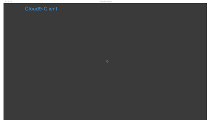

# cloud9-client
  
This is client app for [cloud9 IDE(local stand alone)](https://github.com/c9/core)


### Download app file
https://github.com/ichiwa/cloud9-client/releases

### Run

```
$ npm install
$ npm start
```

### Build
If you want to build the application, execute following command.
```
$ npm run build
```
Builds the app for macOS in `./dist` directory.

## Dependencies

node.js and cloud9 

## My Environment
OSX El Captian 10.11.6  
node.js 6.5.0  
cloud9 3.1.3059  

## License

MIT © [Ichiwa](https://github.com/ichiwa)
