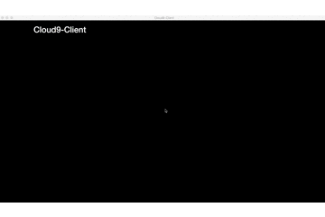

# cloud9-client


## Dev

```
$ npm install
```

### Run

```
$ npm start
```

### Demo



### Build

```
$ npm run build
```

Builds the app for macOS in `./dist` directory.


## License

MIT © [Ichiwa](https://github.com/ichiwa)

## Version

node.js 6.5.0
cloud9 3.1.3059
